# Quantum Computing in Scala

Modeling  Quantum Computing concepts (Qbits, quantum state, circuits, gates, measurements, etc.) in Scala, 
taking advantage of the nice language features. 
A few simple examples, and Grover's algorithm are included.

## Basic Concepts

### Complex numbers

```scala
case class Complex(val re: Double, val im: Double)
```

Scala features that make the implementation elegant:

* lazy val

```scala
lazy val conj = Complex(re, -im)
lazy val norm2 = re * re + im * im
```
      
* unary operators

```scala
def unary_- = this * -1.0
 ```
    
* implicit method

```scala
implicit def toImaginary(x: Double) = new {
  def i = new Complex(0.0, x)
}
```

* implicit conversion

```scala 
implicit def toComplex(x: Double) = new Complex(x, 0.0)
```

### Labeled

```scala     
trait Labeled {
    val label: String
    override def toString = label
}
```
    
Tensor (similar to Scala's Tuple2):

```scala 
case class Tensor[+L1 <: Labeled, +L2 <: Labeled](_1: L1, _2: L2) extends Labeled {
    val label = _1.label + "," + _2.label
}
```
      
### Symbols and Words

Symbols or letters represent the units of information:

```scala 
abstract class Symbol extends Labeled
```

* spin

```scala  
// Sign { |+>, |-> }
abstract sealed class Sign(val label: String) extends Symbol
case object S_+ extends Sign("+")
case object S_- extends Sign("-")
```
      
* polarization

```scala  
// H-V polarization
abstract sealed class Polarization(val label: String) extends Symbol
case object Horizontal extends Polarization("H")
case object Vertical extends Polarization("V")
```
 
 * binary
 
```scala
// Standard { |0>, |1> }
abstract sealed class Std(val label: String) extends Symbol
case object S0 extends Std("0")
case object S1 extends Std("1")
```
 
Words (symbol strings) represent outcomes or final states:

```scala
case class Word[B <: Symbol](letters: List[B]) extends Labeled {
  val label = letters.map(_.label).mkString
}
```

## Quantum Concepts

### Quantum State

A mapping that associates a complex number (amplitude) to each possible outcome:

```scala
case class QState[A <: Labeled](state: (A, Complex)*)
```

If outcomes are repeated the amplitudes are combined:

```scala
// Collect like terms and sum their coefficients
private def collect: QState[A] = {
  QState(state.groupBy(_._1).toList.map {
    case (a, azs) => (a, azs.map(_._2).foldLeft(Complex.zero)(Complex.plus))
  }: _*)
}
```

Quantum state is monadic:

* map

```scala
private def map[B <: Labeled](f: A => B): QState[B] = {
  QState(state.map { case (a, z) => (f(a), z) }: _*).collect
}
```

* flatMap ( >>= )

```scala
def flatMap[B <: Labeled](f: A => QState[B]): QState[B] = {
  QState(state.flatMap { case (a, z) => f(a).mapV(_ * z).state }: _*).collect
}

private def mapV(f: Complex => Complex): QState[A] = {
  QState(state.map { case (a, z) => (a, f(z)) }: _*)
}
```

* pure (single certain outcome)

```scala
def pure[A <: Labeled](a: A): QState[A] = new QState(a -> Complex.one)
```

Quantum state is collapsed into one of possible outcomes when measured. 

```scala
case class Measurement[A <: Labeled, B](outcome: B, newState: QState[A])
```

In the most common case the new state is the pure representation of the outcome.

Products of quantum states:

* inner ( <> )

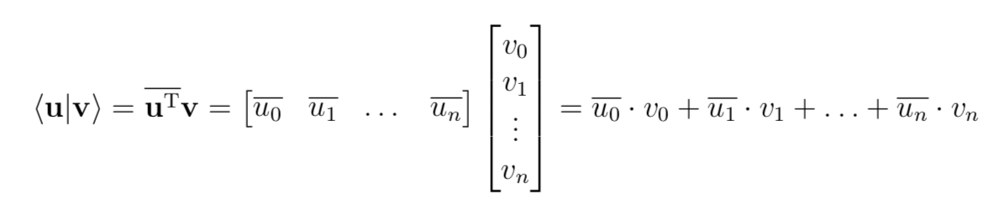

```scala
// Inner product
def inner(that: QState[A]): Complex = {
  this.state.map { case (l, v) => v.conj * that(l) }.foldLeft(Complex.zero)(Complex.plus)
}
```

* outer ( >< )

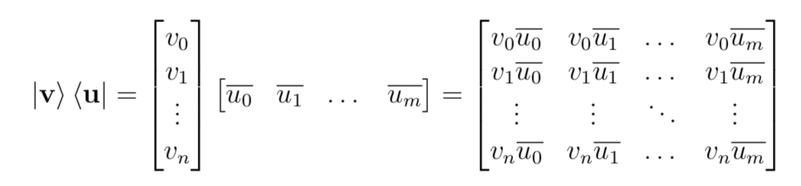

```scala
// Outer product
def outer[B <: Labeled](that: QState[B]): B => QState[A] = {
  (b: B) => this * that(b).conj
}
```

* tensor

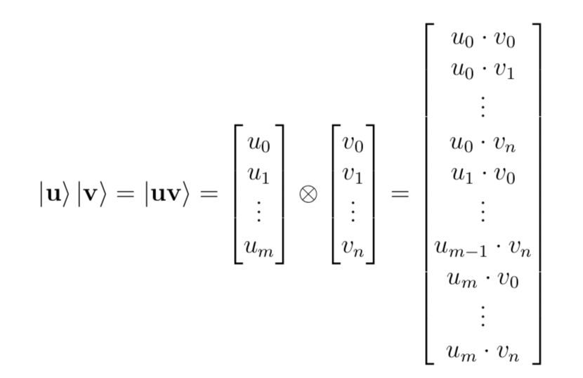

```scala
// Tensor product
def *[B <: Labeled](that: QState[B]): QState[Tensor[A, B]] = {
  for {
    x <- this
    y <- that
  } yield Tensor(x, y)
}
```

Some important states:

 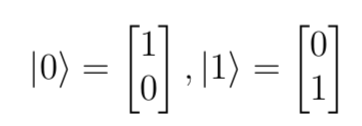
 
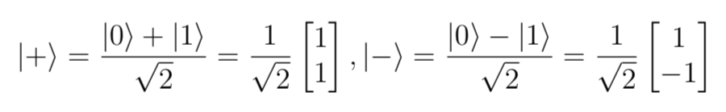
 
```scala
val rhalf: Complex = math.sqrt(0.5)

// Some pure states
val s0: QState[Std] = pure(S0)
val s1: QState[Std] = pure(S1)

val plus: QState[Std] = QState(S0 -> rhalf, S1 -> rhalf)
val minus: QState[Std] = QState(S0 -> rhalf, S1 -> -rhalf)

val s_+ = pure(S_+)
val s_- = pure(S_-)
```

### Quantum Gates

A quantum gate represents a state transformation. It is enough to define it
on the current basis.

```scala
class Gate[A, B <: Labeled](val f: A => QState[B])
```

A gate can be applied to a state:

```scala
def apply(s: QState[A with Labeled]) = s.flatMap(f)
```

Gates can be composed ( >=> )):

```scala
def >=>[C <: Labeled](g: B => QState[C]): A => QState[C] = (a: A) => f(a) >>= g
```

A gate is essentially a function:

```scala
implicit def functionToGate[A, B <: Labeled](f: A => QState[B]): Gate[A, B] = new Gate(f)
implicit def gateToFunction[A, B <: Labeled](op: Gate[A, B]): A => QState[B] = op.f
```

Some important gates:

* Pauli X (NOT)

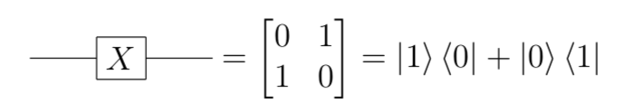

```scala
// NOT gate
val X: Gate[Std, Std] = (s1 >< s0) + (s0 >< s1)
 ```
 
* Hadamard

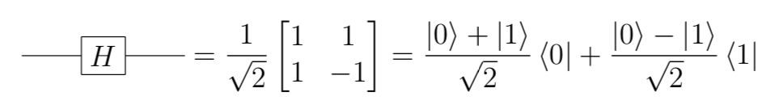

```scala
// Hadamard gate
val H: Gate[Std, Std] = (plus >< s0) + (minus >< s1)
```

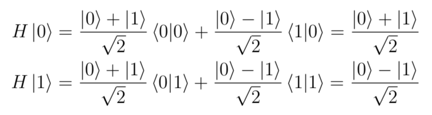

* Pauli Z

```scala
// Phase flip gate
val Z: Gate[Std, Std] = (s0 >< s0) + (-s1 >< s1)
```

An integer function can be represented as a gate:

```scala
// Implementation of a integer function as a quantum gate
def U(f: Int => Int): Tensor[Word[Std], Word[Std]] => QState[Tensor[Word[Std], Word[Std]]] = s => {
  val Tensor(x, out) = s
  val fx = Symbol.fromInt(f(Symbol.toInt(x)) ^ Symbol.toInt(out), out.letters.length)
  pure(x) * pure(fx)
}
```

Gates can be lifted to tensor products in a natural way.

### Rotations

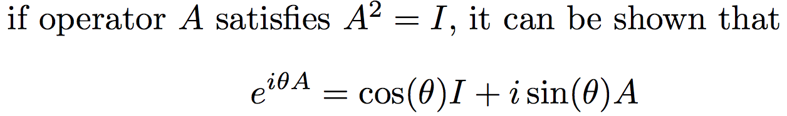
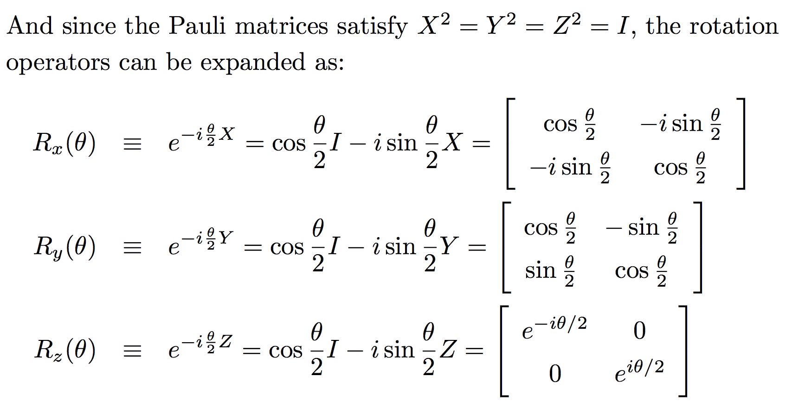

The implemementation is straightforward given the foundation built so far.
```scala
  def Rx(theta: Double): Gate[Std, Std] = I[Std] * math.cos(theta / 2) - X * Complex.i * math.sin(theta / 2)

  def Ry(theta: Double): Gate[Std, Std] = I[Std] * math.cos(theta / 2) - Y * Complex.i * math.sin(theta / 2)

  def Rz(theta: Double): Gate[Std, Std] = I[Std] * math.cos(theta / 2) - Z * Complex.i * math.sin(theta / 2)
```

Notice that Rx(pi) = -iX, Ry(pi) = -iY, and Rz(pi) = -iZ have nice interpretations.

```scala
  "Rx(pi)" should "swap the amplitudes of |0> and |1> and rotate them by -pi/2" in forAll { s: QState[Std] =>

    val r: QState[Std] = Rx(math.Pi)(s)

    assert(r(S0).toString == (s(S1) * Complex.one.rot(-math.Pi/2)).toString)
    assert(r(S1).toString == (s(S0) * Complex.one.rot(-math.Pi/2)).toString)
  }
```

```scala
  "Ry(pi)" should "swap the amplitudes of |0> and |1> and flip the sign of |1> (rotate by pi)" in forAll { 
    s: QState[Std] =>

    val t: QState[Std] = Ry(math.Pi) (s)

    assert(t(S0).toString == (-s(S1)).toString)
    assert(t(S1).toString == s(S0).toString)

    // rotation by pi in a 4-dimensional space (2 complex numbers as components)
    // similar to a rotation by pi/2 in the 2-dimensional case, same as multiplying a complex number by i
    // z = a + bi
    // i*z = -b + ai
  }
```

```scala
  "Rz(pi)" should "rotate the amplitude of |0> by -pi/2 and the amplitude of |1> by pi/2" in forAll { s: QState[Std] =>

    val z: QState[Std] = Rz(math.Pi)(s)

    // Rz rotates the amplitude of |0> by -theta/2
    assert(z(S0) == s(S0) * Complex.one.rot(-math.Pi / 2))
    // Rz rotates the amplitude of |1> by theta/2
    assert(z(S1) == s(S1) * Complex.one.rot(math.Pi / 2))
  }
```
In general one can think of Rx, Ry and Rz as weighted averages between
the identity gate I and Rx(pi), Ry(pi) and Rz(pi), respectively. 
These four gates also form a quaternion basis.

```scala
  "Rx(pi)Rx(pi)" should "equal -I (quaternion basis)" in forAll { s: QState[Std] =>

    val t: QState[Std] = Rx(math.Pi)(Rx(math.Pi)(s))

    assert(t(S0).toString == (-s(S0)).toString)
    assert(t(S1).toString == (-s(S1)).toString)
  }

  "Ry(pi)Ry(pi)" should "equal -I (quaternion basis)" in forAll { s: QState[Std] =>

    val t: QState[Std] = Ry(math.Pi)(Ry(math.Pi)(s))

    assert(t(S0).toString == (-s(S0)).toString)
    assert(t(S1).toString == (-s(S1)).toString)
  }

  "Rz(pi)Rz(pi)" should "equal -I (quaternion basis)" in forAll { s: QState[Std] =>

    val t: QState[Std] = Rz(math.Pi)(Rz(math.Pi)(s))

    assert(t(S0).toString == (-s(S0)).toString)
    assert(t(S1).toString == (-s(S1)).toString)
  }

  "Rx(pi)Ry(pi)Rz(pi)" should "equal -I (quaternion basis)" in forAll { s: QState[Std] =>

    val z: QState[Std] = Rz(math.Pi)(s)
    val y: QState[Std] = Ry(math.Pi)(z)
    val x: QState[Std] = Rx(math.Pi)(y)


    assert(x(S0).toString == (-s(S0)).toString)
    assert(x(S1).toString == (-s(S1)).toString)
  }
```

### Quantum Algorithms

Grover's algorithm (quantum search)

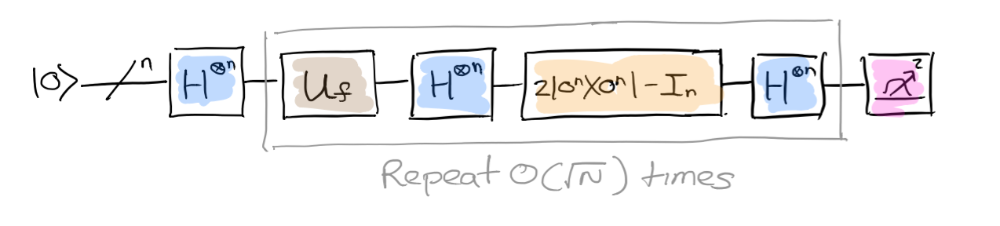

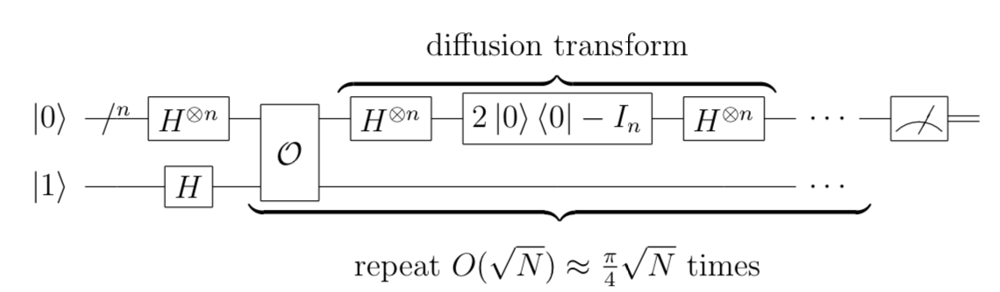


```scala
  /**
   * Grover's algorithm
   */
  def grover(f: Int => Int, width: Int) = {
    val Hn = liftWord(H) _
    val zeroes = pure(Symbol.fromInt(0, width))
    val one = pure(Symbol.fromInt(1, 1))
    val inv = U(f)
    val refl = {
      val s = zeroes >>= Hn
      (s >< s) * 2 - I
    }

    val r = (math.Pi * math.sqrt(math.pow(2, width)) / 4).toInt
    val init = zeroes * one >>= lift12(Hn, Hn)
    iterate(r, init)(_ >>= (inv >=> lift1(refl)))
  }
```

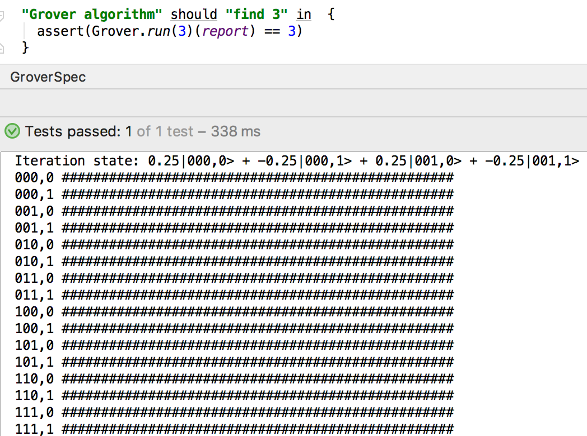

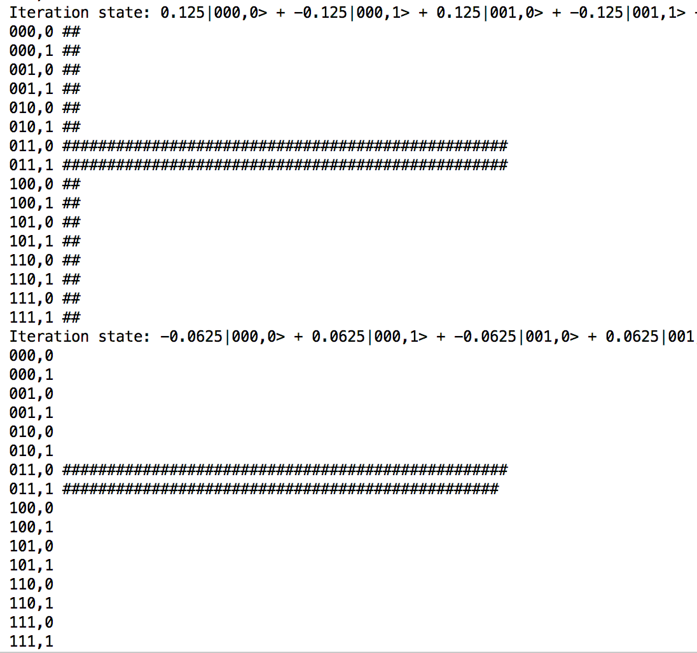

## Credits and References

https://github.com/jliszka/quantum-probability-monad

https://people.cs.umass.edu/~strubell/doc/quantum_tutorial.pdf

http://www.vcpc.univie.ac.at/~ian/hotlist/qc/talks/bloch-sphere-rotations.pdf

https://quantumexperience.ng.bluemix.net/proxy/tutorial/full-user-guide/004-Quantum_Algorithms/070-Grover's_Algorithm.html